# 基于Springboot的服装销售平台

## Springboot-0043


## 技术栈

Springboot mybatisplus vue mysql maven


## 数据库表(16张)


## 功能介绍

```properties
功能有管理员和用户两个角色。管理员有个人中心，用户管理，商品分类管理，颜色管理，尺码管理，商品信息管理，订单评价管理，系统管理，订单管理。用户可以注册登录，登录后在前台首页可以查看商品信息，商品资讯，在个人中心可以修改个人资料，查看我的订单，我的地址，我的收藏等信息，后台管理可以查看自己的订单。
```


## 图片

### 前台


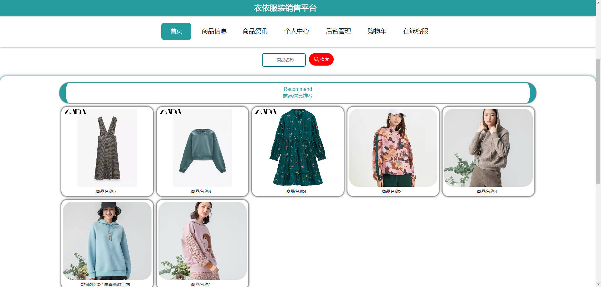

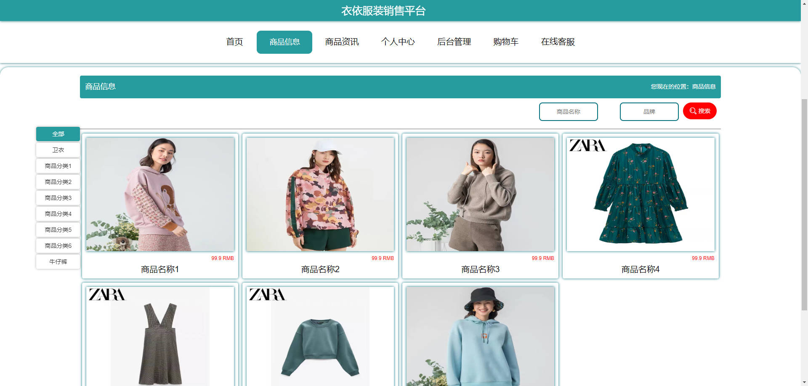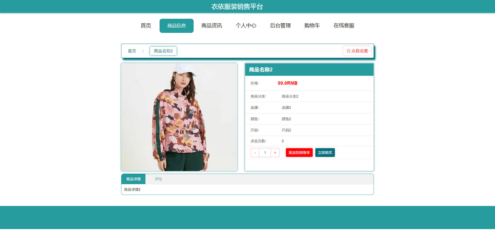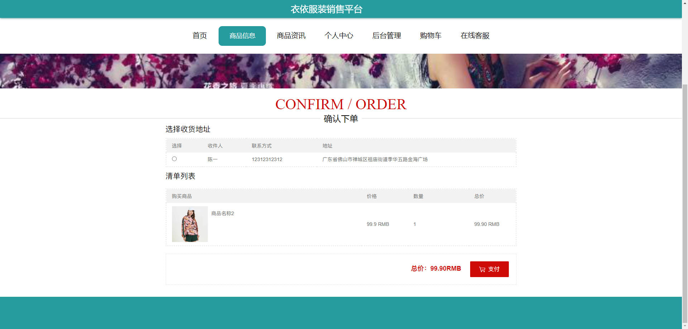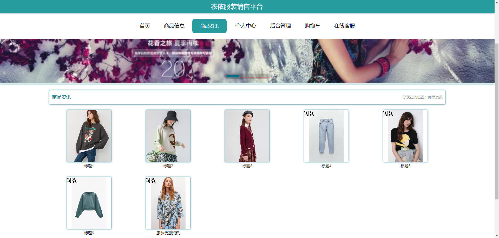

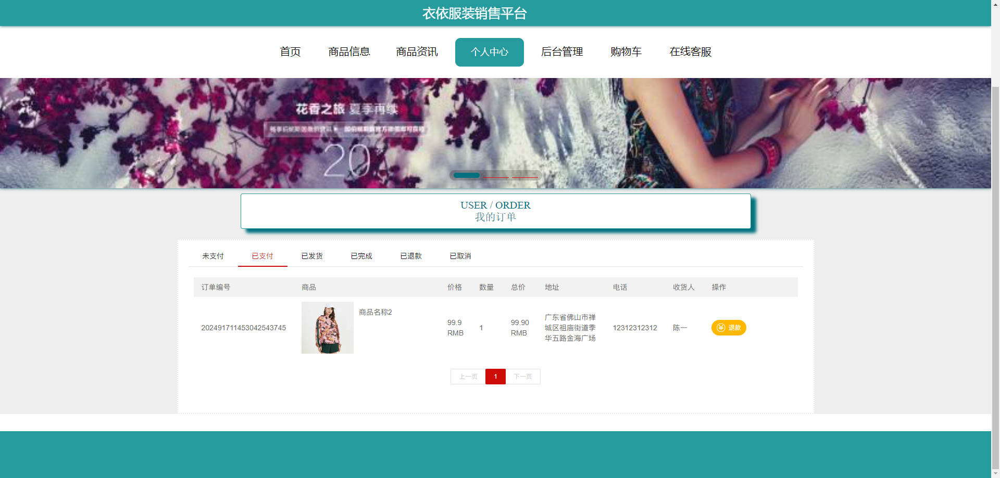

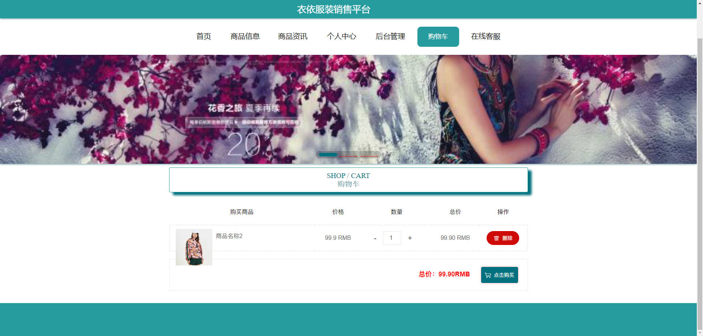

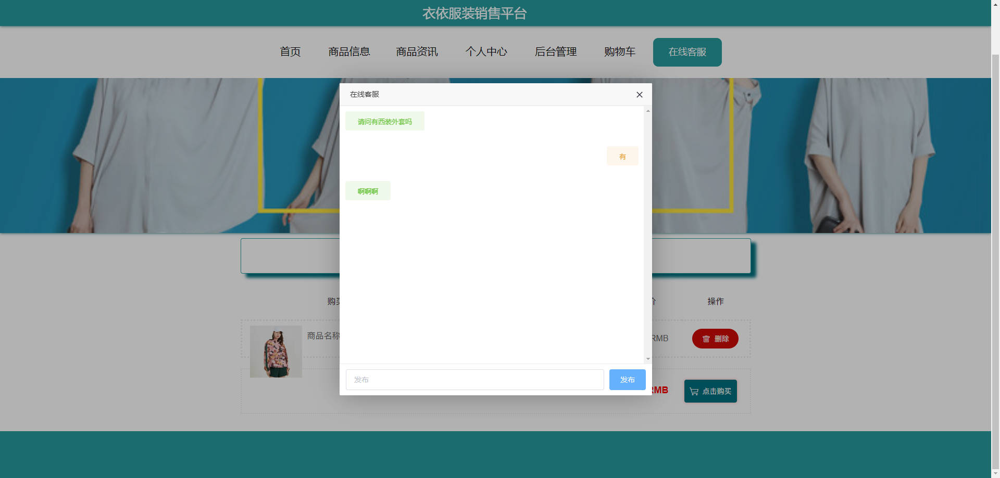

### 后台


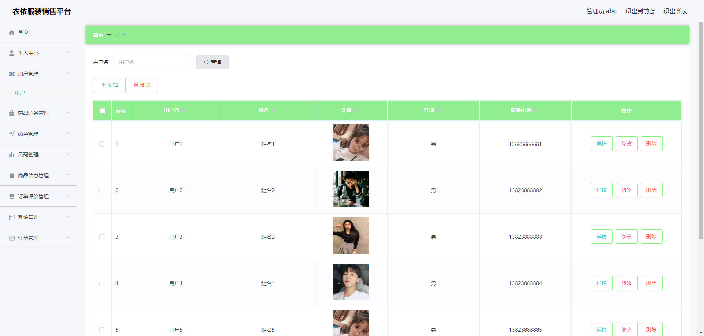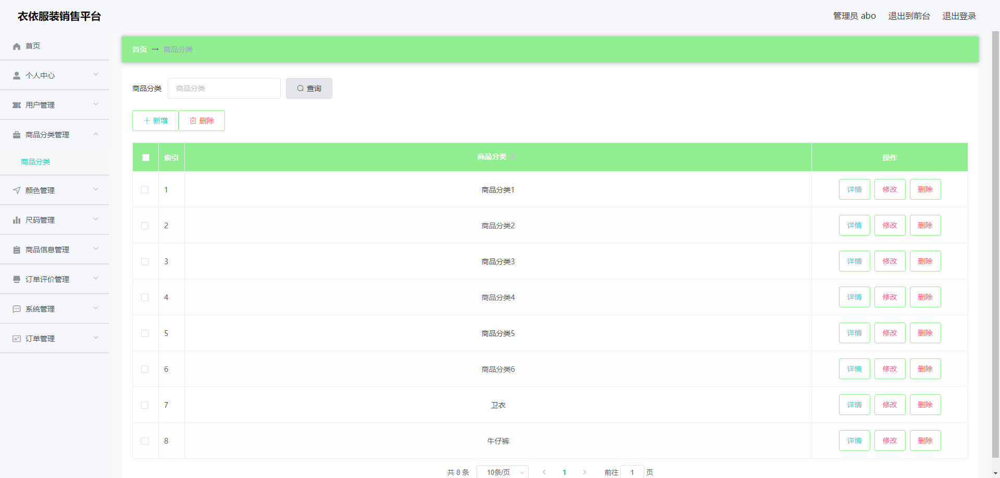

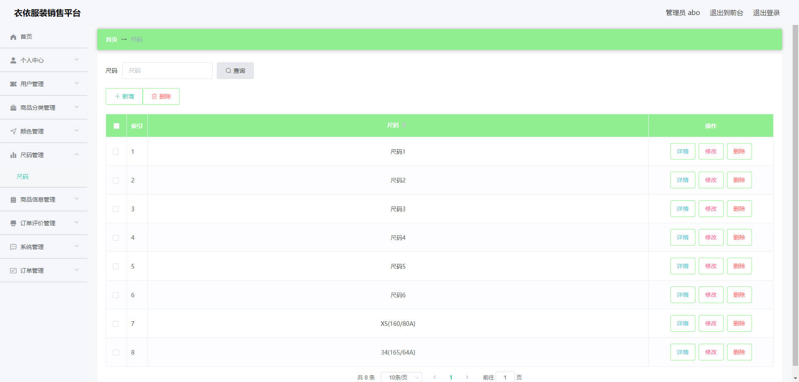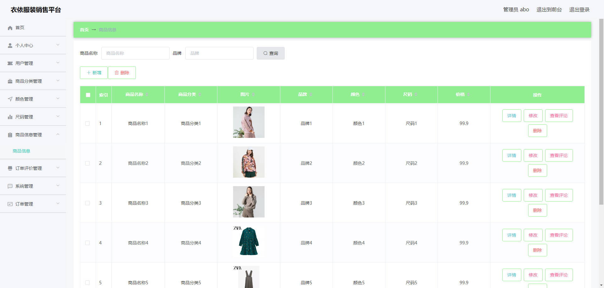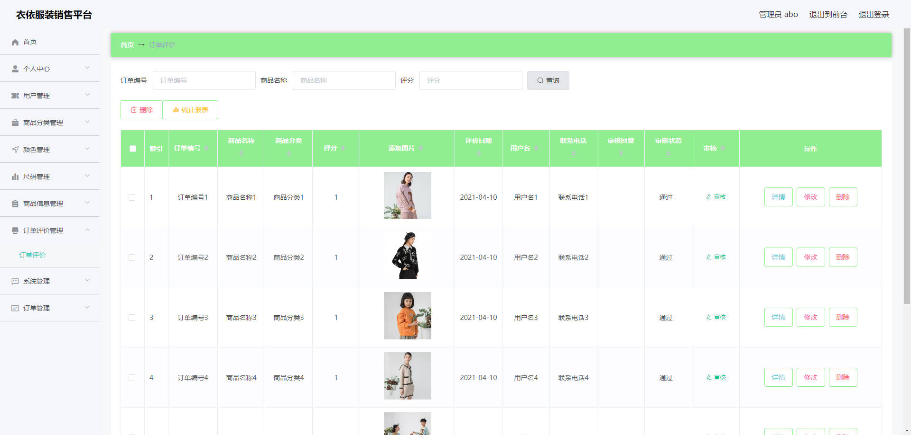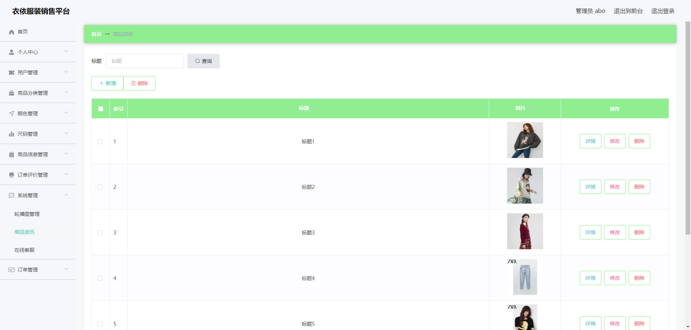

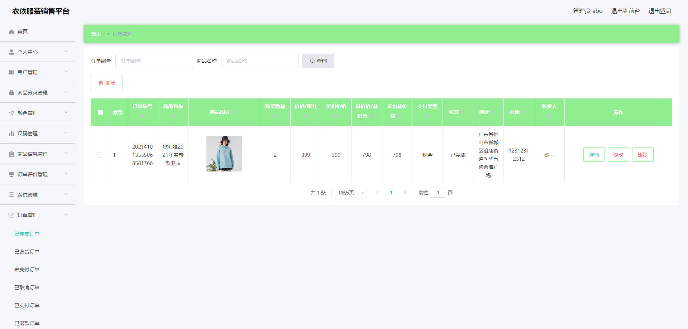


## 访问路径

### 前台

```properties
http://localhost:8080/springboot4r3y8/front/pages/login/login.html

账号 1
密码 11
```

### 后台

```properties
http://localhost:8080/springboot4r3y8/admin/dist/index.html#/login

账号 abo
密码 abo
```


## 功能图

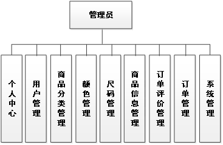


## 文档目录

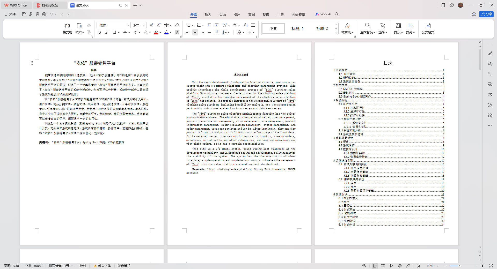


## 打赏或交流


